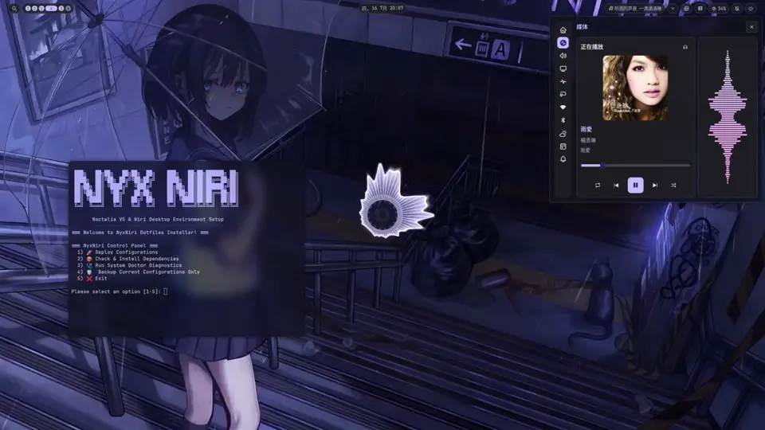
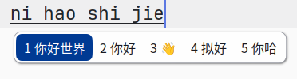
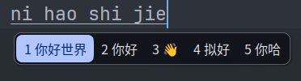

<div align="right">
  <a href="#english">English</a> | <a href="#chinese">简体中文</a>
</div>

<div align="center">
<a id="english"></a>

# 𝑁𝑦𝑥𝑁𝑖𝑟𝑖

> A Material You desktop for Arch / CachyOS, built on Niri and Noctalia V5.

<p align="center">
  
  
  
  
  
</p>



[Video preview on Bilibili](https://www.bilibili.com/video/BV1Dig16rEZ7/)

</div>

## Preview / 预览

<p align="center">
  
  
</p>

*The NyxMellow fcitx5 skin — colors follow the Noctalia palette in light and
dark mode.*

## Features

- **Material You colors** — extracted from your wallpaper by Noctalia V5; an
  `mpvpaper` hook sends video-wallpaper frames through `ffmpeg` so they theme too.
- **Light/dark sync** — GSettings and GTK follow Noctalia automatically.
- **Focus Mode (`Super+N`)** — warm color temperature, no window blur, opaque
  backgrounds for long sessions.
- **Terminal & shell** — Fish aliases for proxy and cache, Kitty cursor trails
  and Windows-style shortcuts.
- **Dynamic fcitx5 skin** — NyxMellow: mellow shape, Noctalia colors.

## Requirements

- Arch Linux / CachyOS
- [Niri](https://github.com/YaLTeR/niri) (Wayland compositor)
- [Noctalia V5](https://noctalia.app) (desktop shell, AUR)
- `mpvpaper` (AUR), Kitty, Fish, Starship

## Install

### Standalone (online)

```bash
curl -sL --connect-timeout 10 https://raw.githubusercontent.com/ech678/NyxNiri/main/install.sh | bash
```

### From a git checkout (recommended)

```bash
git clone https://github.com/ech678/NyxNiri.git ~/NyxNiri
cd ~/NyxNiri && ./install.sh
```

<details>
<summary>Mirrors for China (gh-proxy / CDN)</summary>

```bash
# Standalone via gh-proxy.org
curl -sL --connect-timeout 10 https://gh-proxy.org/https://raw.githubusercontent.com/ech678/NyxNiri/main/install.sh | bash

# Standalone via ghproxy.net
curl -sL --connect-timeout 10 https://ghproxy.net/https://raw.githubusercontent.com/ech678/NyxNiri/main/install.sh | bash

# git clone via gh-proxy.org
git clone https://gh-proxy.org/https://github.com/ech678/NyxNiri.git ~/NyxNiri
cd ~/NyxNiri && ./install.sh
```

`install.sh` falls back through Official → jsDelivr CDN → gh-proxy automatically.
</details>

> `install full` bootstraps `paru` when no AUR helper is available (`noctalia`
> and `mpvpaper` are AUR packages). Existing configs can be backed up to
> `~/.config/NyxNiri/backups/` before deploy. The legacy DMS setup lives on the
> `archive/v1-dms` branch.

## Included Configs

```text
NyxNiri
├── install.sh                  # installer (backup + dependency check)
├── lib/                        # deploy, backup, network, doctor, i18n…
├── Wallpapers/                 # wallpaper library
├── fcitx5/                     # NyxMellow fcitx5 skin templates
└── v2/
    ├── niri/                   # window manager
    ├── noctalia/               # shell + theme sync
    ├── kitty/                  # terminal
    ├── fish/                   # aliases + functions
    ├── fastfetch/              # system info
    ├── zed/                    # editor
    └── starship.toml           # prompt
```

> Configs are replaced atomically on update. To keep personal tweaks:
> - files matching `*__custom__*` (e.g. `__custom__.kdl`, `01__custom__.fish`)
>   are preserved — number prefixes control load order
> - any `*__custom__*` folder (e.g. `~/.config/niri/__custom__/`) is kept as-is

## Tooling

`nyxniri` manages install, snapshots and diagnostics:

| Command | Description |
| --- | --- |
| `nyxniri` | Interactive menu |
| `nyxniri install [full\|config]` | Deploy everything, or sync configs only |
| `nyxniri update [--force]` | Update repo, optionally overwrite configs |
| `nyxniri snapshot [note]` | Save the current config state |
| `nyxniri rollback [index]` | Restore a snapshot |
| `nyxniri list` | List snapshots |
| `nyxniri uninstall` | Remove NyxNiri, restore previous configs |
| `nyxniri purge` | Remove configs, cache and wallpapers |
| `nyxniri doctor` | Dependency + system health check |
| `nyxniri fcitx [install\|status\|uninstall]` | NyxMellow fcitx5 skin |
| `nyxniri greeter [install\|status\|uninstall]` | Noctalia Greeter (login screen) |

`nyxhelp` is a fzf-based cheatsheet:

| Command | Description |
| --- | --- |
| `nyxhelp` | Interactive dual-panel cheatsheet |
| `nyxhelp keys` | Niri keybindings |
| `nyxhelp proxy` | Proxy controls (`proxy_on [port]`, `proxy_off`, `proxy_status`) |
| `nyxhelp pkg` | Package shortcuts (`up`, `in`, `se`, `un`, `clean`) |
| `nyxhelp all` | Full cheatsheet |

## Keybindings

<details>
<summary>Window management</summary>

| Shortcut | Action |
| :--- | :--- |
| <kbd>Super</kbd> + <kbd>Enter</kbd> | Open terminal |
| <kbd>Super</kbd> + <kbd>Q</kbd> | Close window |
| <kbd>Super</kbd> + <kbd>T</kbd> | Toggle floating/tiling |
| <kbd>Super</kbd> + <kbd>F</kbd> | Maximize current column |
| <kbd>Super</kbd> + <kbd>Shift</kbd> + <kbd>F</kbd> | Fullscreen |
| <kbd>Super</kbd> + <kbd>Tab</kbd> | Workspace overview |
| <kbd>Super</kbd> + <kbd>Z</kbd> | Focus left |
| <kbd>Super</kbd> + <kbd>C</kbd> | Focus right |
| <kbd>Super</kbd> + <kbd>J</kbd> / <kbd>K</kbd> | Focus down/up |
| <kbd>Super</kbd> + <kbd>Arrows</kbd> | Smart focus (column/monitor/workspace) |
| <kbd>Super</kbd> + <kbd>Ctrl</kbd> + <kbd>Arrows</kbd> | Smart move (column/monitor/workspace) |
| <kbd>Super</kbd> + <kbd>D</kbd> / <kbd>U</kbd> | Workspace down/up |
| <kbd>Super</kbd> + <kbd>Space</kbd> | Switch preset column widths |
| <kbd>Super</kbd> + <kbd>-</kbd> / <kbd>=</kbd> | Decrease/increase column width |

</details>

<details>
<summary>System & components</summary>

| Shortcut | Action |
| :--- | :--- |
| <kbd>Super</kbd> + <kbd>R</kbd> | App launcher |
| <kbd>Super</kbd> + <kbd>E</kbd> | File manager |
| <kbd>Super</kbd> + <kbd>X</kbd> | Power menu |
| <kbd>Super</kbd> + <kbd>I</kbd> | Control center |
| <kbd>Super</kbd> + <kbd>V</kbd> | Clipboard history |
| <kbd>Super</kbd> + <kbd>W</kbd> | Static wallpaper picker |
| <kbd>Super</kbd> + <kbd>Shift</kbd> + <kbd>W</kbd> | Live wallpaper picker |
| <kbd>Super</kbd> + <kbd>N</kbd> | Toggle Focus Mode |
| <kbd>Super</kbd> + <kbd>L</kbd> | Lock screen |
| <kbd>Super</kbd> + <kbd>Shift</kbd> + <kbd>S</kbd> | Screenshot |
| <kbd>Super</kbd> + <kbd>Shift</kbd> + <kbd>R</kbd> | Reload Niri |
| <kbd>Super</kbd> + <kbd>Shift</kbd> + <kbd>E</kbd> | Quit Niri |

</details>

> Full reference: `nyxhelp keys`, or press <kbd>Super</kbd> + <kbd>/</kbd> in Niri.

## Optional Modules

**NyxMellow fcitx5 skin** — a mellow-shaped skin whose colors follow the
Noctalia palette (light/dark auto-switch). Run `nyxniri fcitx install`: it
registers a Noctalia template and re-renders on every wallpaper / mode change.

**Noctalia Greeter** — a greetd login screen matching the Noctalia theme. Run
`nyxniri greeter install` (installs `greetd` + `noctalia-greeter` from AUR,
backs up `/etc/greetd/config.toml`, writes a Polkit rule). It never disables an
existing display manager.

## Troubleshooting

**Noctalia hangs on startup** — `ddcutil` scanning the I2C bus can time out,
especially on NVIDIA. Disable it in `~/.config/noctalia/noctalia-config.toml`:

```toml
[brightness]
enable_ddcutil = false
```

**Plugin repo corrupted** — Noctalia stuck while checking out plugins:

```bash
git -C ~/.local/state/noctalia/plugins/sources/community/repo reset --hard HEAD
git -C ~/.local/state/noctalia/plugins/sources/official/repo reset --hard HEAD
```

**Greeter sync asks for a password** — add a Polkit rule (`nyxniri greeter
install` does this for you):

```bash
sudo bash -c 'cat > /etc/polkit-1/rules.d/50-noctalia-greeter.rules << EOF
polkit.addRule(function(action, subject) {
    if (action.id == "org.noctalia.greeter.apply-appearance" &&
        subject.isInGroup("wheel")) {
        return polkit.Result.YES;
    }
});
EOF'
```

## Credits & License

Contact: QQ `2040244628` · Telegram [@Echoes678](https://t.me/Echoes678) ·
Linux Ricing Group `631425889` · [Sponsor](https://afdian.com/a/Echoes678) ·
[Report a bug](https://github.com/ech678/NyxNiri/issues)

Thanks to:

- [RanXom/glassy-niri](https://github.com/RanXom/glassy-niri)
- [SHORiN-KiWATA/shorin-niri](https://github.com/SHORiN-KiWATA/shorin-niri)
- [sanweiya/fcitx5-mellow-themes](https://github.com/sanweiya/fcitx5-mellow-themes) —
  the mellow shape behind the NyxMellow skin
- [StarWhiteIsBusy/Round-Simple-Fcitx5-Skin](https://github.com/StarWhiteIsBusy/Round-Simple-Fcitx5-Skin) —
  the Noctalia color-sync pattern used by the NyxMellow skin

Recommended:

- [h465855hgg/noctalia-lyrics](https://github.com/h465855hgg/noctalia-lyrics) —
  desktop lyrics widget
- [Ocfeather/chrome-niri-opacity](https://github.com/Ocfeather/chrome-niri-opacity) —
  browser opacity script

GPL-3.0 · see [LICENSE](./LICENSE) · changelog in [CHANGELOG.md](./CHANGELOG.md)

---

<div align="center">
<a id="chinese"></a>

# 𝑁𝑦𝑥𝑁𝑖𝑟𝑖

> 基于 Niri 与 Noctalia V5 的 Material You 桌面，适用于 Arch / CachyOS。

</div>

## 核心特性

- **Material You 取色** — 由 Noctalia V5 从壁纸提取；`mpvpaper` 钩子把视频壁纸帧经 `ffmpeg` 送进取色管线，动态壁纸同样参与取色。
- **明暗同步** — GSettings 与 GTK 自动跟随 Noctalia 切换。
- **护眼模式（`Super+N`）** — 调暖色温、关闭模糊、强制不透明背景，适合长时间阅读。
- **终端与 Shell** — Fish 代理/缓存别名，Kitty 光标轨迹与 Windows 风格快捷键。
- **动态 fcitx5 皮肤** — NyxMellow：mellow 圆角形状 + Noctalia 自动取色。

## 环境要求

- Arch Linux / CachyOS
- [Niri](https://github.com/YaLTeR/niri)（Wayland 合成器）
- [Noctalia V5](https://noctalia.app)（桌面 Shell，AUR）
- `mpvpaper`（AUR）、Kitty、Fish、Starship

## 安装部署

### 模式一：独立一键安装（在线）

```bash
curl -sL --connect-timeout 10 https://raw.githubusercontent.com/ech678/NyxNiri/main/install.sh | bash
```

### 模式二：Git 仓库部署（推荐）

```bash
git clone https://github.com/ech678/NyxNiri.git ~/NyxNiri
cd ~/NyxNiri && ./install.sh
```

<details>
<summary>国内网络加速（gh-proxy / CDN 镜像）</summary>

```bash
# 通过 gh-proxy.org 独立安装
curl -sL --connect-timeout 10 https://gh-proxy.org/https://raw.githubusercontent.com/ech678/NyxNiri/main/install.sh | bash

# 通过 ghproxy.net 独立安装
curl -sL --connect-timeout 10 https://ghproxy.net/https://raw.githubusercontent.com/ech678/NyxNiri/main/install.sh | bash

# 通过 gh-proxy.org 克隆仓库
git clone https://gh-proxy.org/https://github.com/ech678/NyxNiri.git ~/NyxNiri
cd ~/NyxNiri && ./install.sh
```

`install.sh` 内置三级自动降级（官方直连 → jsDelivr CDN → gh-proxy）。
</details>

> `install full` 在缺少 AUR helper 时会自动自举 `paru`（`noctalia` 与
> `mpvpaper` 均为 AUR 包）。部署前可先将现有配置备份至
> `~/.config/NyxNiri/backups/`。旧版 DMS 配置位于 `archive/v1-dms` 分支。

## 配置一览

```text
NyxNiri
├── install.sh                  # 安装脚本（含依赖检测与配置备份）
├── lib/                        # 部署、备份、网络、诊断、国际化等模块
├── Wallpapers/                 # 壁纸库
├── fcitx5/                     # NyxMellow fcitx5 皮肤模板
└── v2/
    ├── niri/                   # 窗口管理器
    ├── noctalia/               # 桌面 Shell 与主题同步
    ├── kitty/                  # 终端
    ├── fish/                   # 别名与函数
    ├── fastfetch/              # 系统信息
    ├── zed/                    # 编辑器
    └── starship.toml           # 提示符
```

> 更新时配置目录会被原子替换。个人改动可通过以下方式保留：
> - 文件名含 `*__custom__*` 的文件（如 `__custom__.kdl`、`01__custom__.fish`）会被保留，数字前缀控制加载顺序
> - 任何 `*__custom__*` 文件夹（如 `~/.config/niri/__custom__/`）整体保留

## 工具

`nyxniri` 统一管理安装、快照与诊断：

| 指令 | 作用 |
| --- | --- |
| `nyxniri` | 交互式菜单 |
| `nyxniri install [full\|config]` | 全量部署，或仅同步配置 |
| `nyxniri update [--force]` | 更新仓库，可选覆盖配置 |
| `nyxniri snapshot [备注]` | 保存当前配置状态 |
| `nyxniri rollback [序号]` | 恢复历史快照 |
| `nyxniri list` | 查看快照列表 |
| `nyxniri uninstall` | 卸载并复原配置 |
| `nyxniri purge` | 清除配置、缓存与壁纸 |
| `nyxniri doctor` | 依赖与系统健康检查 |
| `nyxniri fcitx [install\|status\|uninstall]` | NyxMellow fcitx5 皮肤 |
| `nyxniri greeter [install\|status\|uninstall]` | Noctalia Greeter（登录界面） |

`nyxhelp` 是基于 `fzf` 的速查手册：

| 指令 | 作用 |
| --- | --- |
| `nyxhelp` | 双栏交互式速查菜单 |
| `nyxhelp keys` | Niri 快捷键 |
| `nyxhelp proxy` | 代理控制（`proxy_on [port]`、`proxy_off`、`proxy_status`） |
| `nyxhelp pkg` | 包管理快捷指令（`up`、`in`、`se`、`un`、`clean`） |
| `nyxhelp all` | 完整速查手册 |

## 快捷键

<details>
<summary>窗口控制</summary>

| 快捷键 | 动作 |
| :--- | :--- |
| <kbd>Super</kbd> + <kbd>Enter</kbd> | 打开终端 |
| <kbd>Super</kbd> + <kbd>Q</kbd> | 关闭窗口 |
| <kbd>Super</kbd> + <kbd>T</kbd> | 切换浮动/平铺 |
| <kbd>Super</kbd> + <kbd>F</kbd> | 最大化当前列 |
| <kbd>Super</kbd> + <kbd>Shift</kbd> + <kbd>F</kbd> | 全屏 |
| <kbd>Super</kbd> + <kbd>Tab</kbd> | 工作区总览 |
| <kbd>Super</kbd> + <kbd>Z</kbd> | 聚焦左侧 |
| <kbd>Super</kbd> + <kbd>C</kbd> | 聚焦右侧 |
| <kbd>Super</kbd> + <kbd>J</kbd> / <kbd>K</kbd> | 聚焦下/上 |
| <kbd>Super</kbd> + <kbd>方向键</kbd> | 智能焦点（自动跨列/跨屏/跨区） |
| <kbd>Super</kbd> + <kbd>Ctrl</kbd> + <kbd>方向键</kbd> | 智能搬运（自动跨屏/跨区） |
| <kbd>Super</kbd> + <kbd>D</kbd> / <kbd>U</kbd> | 工作区下/上 |
| <kbd>Super</kbd> + <kbd>Space</kbd> | 切换预设列宽比例 |
| <kbd>Super</kbd> + <kbd>-</kbd> / <kbd>=</kbd> | 收缩/拉伸列宽 |

</details>

<details>
<summary>系统与组件</summary>

| 快捷键 | 动作 |
| :--- | :--- |
| <kbd>Super</kbd> + <kbd>R</kbd> | 启动器 |
| <kbd>Super</kbd> + <kbd>E</kbd> | 文件管理器 |
| <kbd>Super</kbd> + <kbd>X</kbd> | 电源菜单 |
| <kbd>Super</kbd> + <kbd>I</kbd> | 控制中心 |
| <kbd>Super</kbd> + <kbd>V</kbd> | 剪贴板 |
| <kbd>Super</kbd> + <kbd>W</kbd> | 静态壁纸选择 |
| <kbd>Super</kbd> + <kbd>Shift</kbd> + <kbd>W</kbd> | 动态壁纸选择 |
| <kbd>Super</kbd> + <kbd>N</kbd> | 护眼模式 |
| <kbd>Super</kbd> + <kbd>L</kbd> | 锁屏 |
| <kbd>Super</kbd> + <kbd>Shift</kbd> + <kbd>S</kbd> | 截图 |
| <kbd>Super</kbd> + <kbd>Shift</kbd> + <kbd>R</kbd> | 重载 Niri |
| <kbd>Super</kbd> + <kbd>Shift</kbd> + <kbd>E</kbd> | 退出 Niri |

</details>

> 完整参考：`nyxhelp keys`，或在 Niri 中按 <kbd>Super</kbd> + <kbd>/</kbd>。

## 可选模块

**NyxMellow fcitx5 皮肤** — 圆角 mellow 形状，颜色随 Noctalia 主题自动取色（明暗自动切换）。运行 `nyxniri fcitx install`：注册 Noctalia 模板，并在每次换壁纸/切换明暗时自动重渲染。

**Noctalia Greeter** — 与 Noctalia 主题一致的 greetd 登录界面。运行 `nyxniri greeter install`（安装 `greetd` + `noctalia-greeter`（AUR），备份 `/etc/greetd/config.toml`，写入 Polkit 免密规则）。不会禁用任何已有显示管理器。

## 故障排除

**Noctalia 启动卡死** — 多为 `ddcutil` 扫描 I2C 总线超时（NVIDIA 常见）。在 `~/.config/noctalia/noctalia-config.toml` 中禁用：

```toml
[brightness]
enable_ddcutil = false
```

**插件仓库损坏** — Noctalia 拉取插件卡住：

```bash
git -C ~/.local/state/noctalia/plugins/sources/community/repo reset --hard HEAD
git -C ~/.local/state/noctalia/plugins/sources/official/repo reset --hard HEAD
```

**Greeter 同步需要输密码** — 添加 Polkit 免密规则（`nyxniri greeter install` 会自动写入）：

```bash
sudo bash -c 'cat > /etc/polkit-1/rules.d/50-noctalia-greeter.rules << EOF
polkit.addRule(function(action, subject) {
    if (action.id == "org.noctalia.greeter.apply-appearance" &&
        subject.isInGroup("wheel")) {
        return polkit.Result.YES;
    }
});
EOF'
```

## 致谢与许可

联系：QQ `2040244628` · Telegram [@Echoes678](https://t.me/Echoes678) ·
Linux Ricing 交流群 `631425889` · [赞助支持](https://afdian.com/a/Echoes678) ·
[提交 Bug](https://github.com/ech678/NyxNiri/issues)

致谢：

- [RanXom/glassy-niri](https://github.com/RanXom/glassy-niri)
- [SHORiN-KiWATA/shorin-niri](https://github.com/SHORiN-KiWATA/shorin-niri)
- [sanweiya/fcitx5-mellow-themes](https://github.com/sanweiya/fcitx5-mellow-themes) —
  NyxMellow 皮肤圆角形状的来源
- [StarWhiteIsBusy/Round-Simple-Fcitx5-Skin](https://github.com/StarWhiteIsBusy/Round-Simple-Fcitx5-Skin) —
  NyxMellow 皮肤所采用的 Noctalia 取色联动方案参考

推荐项目：

- [h465855hgg/noctalia-lyrics](https://github.com/h465855hgg/noctalia-lyrics) —
  桌面歌词组件
- [Ocfeather/chrome-niri-opacity](https://github.com/Ocfeather/chrome-niri-opacity) —
  浏览器透明度脚本

GPL-3.0 · 见 [LICENSE](./LICENSE) · 更新日志见 [CHANGELOG.md](./CHANGELOG.md)

---

<div align="right">
  <a href="#english">Back to Top / 返回顶部</a>
</div>
